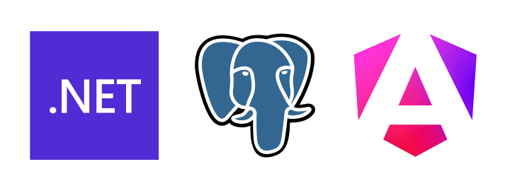

<div align="center">
<h1>Proyecto de Gestión de Escuela de Magia y Hechicería - Hogwarts</h1>

<br>
<br>
</div>

[](https://opensource.org/licenses/MPL-2.0)

## Descripción

Este proyecto es parte de la formación en Análisis y Desarrollo de Software (ADSO) del Servicio Nacional de Aprendizaje (SENA) durante el año 2024. El objetivo del proyecto es desarrollar una aplicación web para la gestión de estudiantes, casas, asignaturas y profesores en el universo de Harry Potter. El proyecto utiliza principios de Domain-Driven Design (DDD), arquitectura limpia, y patrones de CQRS y Mediator.

## Tecnologías Utilizadas

- **Backend**: ASP.NET Core 8.0
- **Frontend**: Angular 18.0
- **Base de Datos**: PostgreSQL 16.3 (alpine3.20) alojada en un contenedor Docker
- **Administrador de Base de Datos**: pgAdmin4 (REL-8_0) alojado en un contenedor Docker
- **Contenedores**: Docker para el despliegue de servicios
- **Otros**: Implementación de MinIO y Redis

## Estructura del Proyecto

El proyecto está organizado en varias capas siguiendo el enfoque de Domain-Driven Design (DDD):

- **Capa de Aplicación**: Coordina la lógica de la aplicación y maneja los casos de uso.
- **Capa de Dominio**: Contiene los modelos de dominio, entidades, agregados y lógica de negocio.
- **Capa de Infraestructura**: Implementa el acceso a datos y otros servicios técnicos.

## Historias de Usuario

### 1. Gestión de Estudiantes

**Como** administrador de Hogwarts, **quiero** poder gestionar los estudiantes, **para** mantener un registro actualizado de los mismos.

### 2. Asignación de Casas

**Como** administrador de Hogwarts, **quiero** asignar estudiantes a diferentes casas, **para** organizar mejor el colegio.

### 3. Gestión de Profesores

**Como** administrador de Hogwarts, **quiero** poder gestionar los profesores, **para** mantener un registro actualizado de los mismos y sus asignaturas.

### 4. Inscripción a Cursos

**Como** estudiante, **quiero** poder inscribirme en diferentes cursos, **para** asistir a las clases que me interesan.

## Diagrama de Clases

El diagrama de clases incluye las siguientes entidades y relaciones:

1. **Estudiante** tiene una relación uno a muchos con **Casa** (un estudiante pertenece a una casa, una casa puede tener muchos estudiantes).
2. **Estudiante** tiene una relación muchos a muchos con **Curso** (un estudiante puede inscribirse en muchos cursos, un curso puede tener muchos estudiantes inscritos).
3. **Profesor** tiene una relación uno a uno con **Asignatura** (un profesor enseña una asignatura, una asignatura es enseñada por un profesor).

## Instalación y Ejecución

### Prerrequisitos

- [.NET Core 8.0 SDK](https://dotnet.microsoft.com/download)
- [Node.js y npm](https://nodejs.org/)
- [Angular CLI](https://angular.io/cli)
- [Docker](https://www.docker.com/)

### Instrucciones

1. **Clonar el repositorio:**

    ```bash
    git clone https://github.com/tuusuario/proyecto-hogwarts.git
    cd proyecto-hogwarts
    ```

2. **Configurar y levantar los contenedores Docker:**

    ```bash
    docker-compose up -d
    ```

3. **Compilar y ejecutar el backend:**

    ```bash
    cd backend
    dotnet build
    dotnet run
    ```

4. **Instalar dependencias y ejecutar el frontend:**

    ```bash
    cd frontend
    npm install
    ng serve
    ```

5. **Acceder a la aplicación:**

    - El backend estará disponible en `http://localhost:5001`.
    - El frontend estará disponible en `http://localhost:4200`.

## Contribuciones

Las contribuciones son bienvenidas. Por favor, sigue los pasos a continuación para contribuir al proyecto:

1. Haz un fork del proyecto.
2. Crea una nueva rama (`git checkout -b feature/nueva-funcionalidad`).
3. Realiza tus cambios y haz commit (`git commit -am 'Añadir nueva funcionalidad'`).
4. Sube los cambios a tu rama (`git push origin feature/nueva-funcionalidad`).
5. Abre un Pull Request.

## Licencia

Este proyecto está licenciado bajo la Licencia Pública de Mozilla (MPL) 2.0. Para más información, consulta el archivo [LICENSE](LICENSE).
