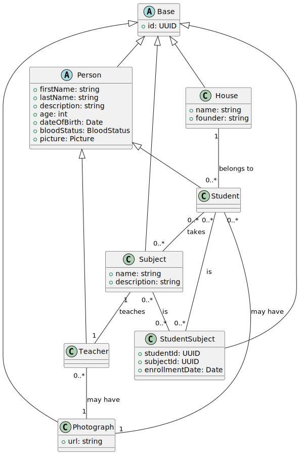

# Aplicación del SENA 2024

## Historias de usuario adaptadas para la gestión de Hogwarts:

### Historia de Usuario 1: Gestión de Estudiantes
**Como** administrador de Hogwarts, **quiero** poder gestionar los estudiantes, **para** mantener un registro actualizado de los mismos.

**Criterios de Aceptación:**
- Puedo añadir nuevos estudiantes con información como nombre, apellido, fecha de nacimiento, casa y Asignaturas inscritos.
- Puedo editar la información de los estudiantes.
- Puedo eliminar estudiantes del registro.
- Puedo ver una lista de todos los estudiantes.

### Historia de Usuario 2: Asignación de Casas
**Como** administrador de Hogwarts, **quiero** asignar estudiantes a diferentes casas, **para** organizar mejor el colegio.

**Criterios de Aceptación:**
- Puedo asignar una casa a un estudiante al momento de su registro.
- Puedo cambiar la casa de un estudiante existente.
- Puedo ver una lista de estudiantes filtrada por casa.

### Historia de Usuario 3: Gestión de Profesores
**Como** administrador de Hogwarts, **quiero** poder gestionar los profesores, **para** mantener un registro actualizado de los mismos y sus asignaturas.

**Criterios de Aceptación:**
- Puedo añadir nuevos profesores con información como nombre, apellido y asignatura.
- Puedo editar la información de los profesores.
- Puedo eliminar profesores del registro.
- Puedo ver una lista de todos los profesores.

### Historia de Usuario 4: Inscripción a Asignaturas
**Como** estudiante, **quiero** poder inscribirme en diferentes asignaturas, **para** asistir a las clases que me interesan.

**Criterios de Aceptación:**
- Puedo ver una lista de asignaturas disponibles.
- Puedo inscribirme en un curso.
- Puedo ver una lista de asignaturas en los que estoy inscrito.
- Puedo darme de baja de un curso.

### Diagrama de Clases
Basado en las historias de usuario, el diagrama de clases incluirá las siguientes entidades y relaciones:




<!-- ```plantuml
@startuml
class Asignatura {
  + id: UUID
  + nombre: string
  + descripcion: string
}

class Profesor {
  + id: UUID
  + nombre: string
  + apellido: string
}

class Casa {
  + id: UUID
  + nombre: string
  + fundadora: string
}

class Estudiante {
  + id: UUID
  + nombre: string
  + apellido: string
  + fechaNacimiento: Date
}

class EstudianteAsignatura {
  + estudianteId: UUID
  + asignaturaId: UUID
  + fechaInscripcion: Date
}

Asignatura "1" -- "1" Profesor: "enseña"
Casa "1" -- "0..*" Estudiante: "pertenece a"
Estudiante "0..*" -- "0..*" Asignatura: "toma"
Estudiante "0..*" -- "0..*" EstudianteAsignatura: "es"
Asignatura "0..*" -- "0..*" EstudianteAsignatura: "es"
@enduml
``` -->

En este diagrama:

- `Estudiante` tiene una relación de uno a muchos con `Casa` (un estudiante pertenece a una casa, una casa puede tener muchos estudiantes).
- `Estudiante` tiene una relación de muchos a muchos con `Asignatura` (un estudiante puede inscribirse en muchas Asignaturas, una Asignatura puede tener muchos estudiantes inscritos) a través de la tabla intermedia `EstudianteAsignatura`.
- `Profesor` tiene una relación de uno a uno con `Asignatura` (un profesor enseña una asignatura, una asignatura es enseñada por un profesor).